# VISENTRA — System Architecture & Forensic User Guide

> **SIH26228 — "From Data to Decision, Proving AI Integrity"**  
> Complete operational manual, interactive interface guide, cryptographic assurance models, and end-to-end data flow specifications for the VISENTRA Computer Vision Supply-Chain Assurance Platform.

---

## Table of Contents

1. [Executive Summary & Core Concept](#1-executive-summary--core-concept)
2. [End-to-End System Architecture](#2-end-to-end-system-architecture)
   - [High-Level Architectural Topology](#high-level-architectural-topology)
   - [Trust Boundaries & Cryptographic Roots](#trust-boundaries--cryptographic-roots)
3. [The Four Pillars of Assurance](#3-the-four-pillars-of-assurance)
   - [Pillar I: Dataset Integrity & Spatial Quality](#pillar-i-dataset-integrity--spatial-quality)
   - [Pillar II: Model Weight Authenticity & Tamper Detection](#pillar-ii-model-weight-authenticity--tamper-detection)
   - [Pillar III: Backdoor & Neural Trojan Interrogation](#pillar-iii-backdoor--neural-trojan-interrogation)
   - [Pillar IV: Inference Binding & Cryptographic Proof](#pillar-iv-inference-binding--cryptographic-proof)
   - [Overall Score Formulation](#overall-score-formulation)
4. [Installation & Operational Setup](#4-installation--operational-setup)
   - [Prerequisites](#prerequisites)
   - [Backend Service Deployment](#backend-service-deployment)
   - [Frontend Instrument Deployment](#frontend-instrument-deployment)
   - [Synthetic Demonstration Seeding](#synthetic-demonstration-seeding)
5. [Forensic Lab Instrument UI Walkthrough](#5-forensic-lab-instrument-ui-walkthrough)
   - [Visual Language & Physical Lab Metaphor](#visual-language--physical-lab-metaphor)
   - [Surface 1: Interactive Lineage Canvas & Top Toolbar](#surface-1-interactive-lineage-canvas--top-toolbar)
   - [Surface 2: Live Supply-Chain Tamper Simulation & Event Drawer](#surface-2-live-supply-chain-tamper-simulation--event-drawer)
   - [Surface 3: Model Interrogation & Cryptographic Diff Room](#surface-3-model-interrogation--cryptographic-diff-room)
   - [Surface 4: Dataset Inspector (Near-Duplicates & OOD)](#surface-4-dataset-inspector-near-duplicates--ood)
   - [Surface 5: Inference Evidence Ledger & Re-verification](#surface-5-inference-evidence-ledger--re-verification)
   - [Surface 6: Formal Cryptographic Assurance Certificate](#surface-6-formal-cryptographic-assurance-certificate)
6. [Interactive User Workflows & Flowcharts](#6-interactive-user-workflows--flowcharts)
   - [Workflow A: Supply-Chain Ingestion & Baseline Verification](#workflow-a-supply-chain-ingestion--baseline-verification)
   - [Workflow B: Detecting Weight Corruption & Visualizing Breach Trajectories](#workflow-b-detecting-weight-corruption--visualizing-breach-trajectories)
   - [Workflow C: Trigger-Consistency Model Interrogation](#workflow-c-trigger-consistency-model-interrogation)
   - [Workflow D: Dataset Sanitization & Anomaly Screening](#workflow-d-dataset-sanitization--anomaly-screening)
   - [Workflow E: Generating and Exporting Audit Certificates](#workflow-e-generating-and-exporting-audit-certificates)
7. [API Specification & Real-Time Event Protocol](#7-api-specification--real-time-event-protocol)
   - [Core REST Endpoints](#core-rest-endpoints)
   - [WebSocket Event Protocol](#websocket-event-protocol)
8. [Troubleshooting & Operational FAQ](#8-troubleshooting--operational-faq)

---

## 1. Executive Summary & Core Concept

In modern Computer Vision (CV) operations, critical classification and object detection pipelines are assembled across fragmented vendors: outsourced datasets, third-party pretrained checkpoints, fine-tuning infrastructure, and edge inference servers. 

Traditional MLOps tools track metadata for reproducibility, but **fail to provide cryptographic proof of integrity**. If an adversary performs a supply-chain attack—such as modifying weights in cloud storage, injecting pixel triggers (backdoors), or presenting synthetic inference outputs—traditional pipelines remain unaware.

**VISENTRA** converts CV supply-chain inspection into an interactive, high-precision forensic instrument:
- **Zero Ambiguity**: Strict content addressing by SHA-256 for all binaries and datasets.
- **Physical Instrument Aesthetic**: Warm paper palette, single-weight vector indicators, zero cosmetic drop-shadows, and monospace evidentiary diffs.
- **Cryptographic Traceability**: Immutable lineage linking `Contributor -> Dataset -> Model -> Inference Evidence -> Certificate`.
- **Active Diagnostics**: Black-box backdoor trigger perturbation tests, Hamming distance near-duplicate clustering, and Out-of-Distribution (OOD) feature distance scoring.

```
+---------------------------------------------------------------------------------------+
|                               VISENTRA INTEGRITY CHAIN                                |
+---------------------------------------------------------------------------------------+
|                                                                                       |
|   [ Contributor ] ---> [ Dataset (SHA-256) ] ---> [ Model (ONNX) ] ---> [ Inference ] |
|          |                     |                         |                      |     |
|     Identity Key         pHash & OOD               Weight Fingerprint      Evidence   |
|     Attribution          De-duplication             & Trojan Scanner        Ledger    |
|                                                                                       |
|                                         |                                             |
|                                         v                                             |
|                    [ Cryptographic Assurance Report (0-100) ]                         |
|                                                                                       |
+---------------------------------------------------------------------------------------+
```

---

## 2. End-to-End System Architecture

### High-Level Architectural Topology

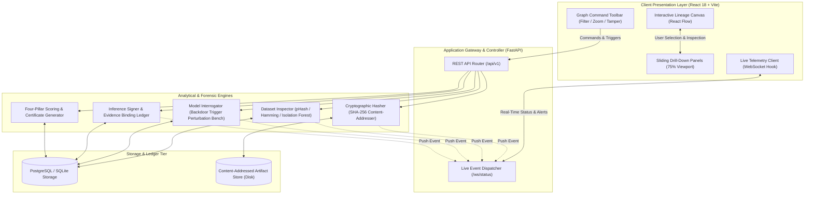

### Trust Boundaries & Cryptographic Roots

1. **Contributor Root**: Every asset uploaded must belong to a registered contributor entity. The contributor UUID acts as the lineage anchor.
2. **Artifact Content-Addressing**: Uploaded models and dataset archives are immediately hashed using standard SHA-256 before disk writes. The filename on disk equals the hash hex string (`storage/<sha256>`).
3. **Immutability Invariant**: No asset can be overwritten in place under the same hash. If an adversary mutates the underlying binary on disk, its hash changes. A verification check recalculates the disk binary's digest and immediately flags the artifact as `tampered`.

---

## 3. The Four Pillars of Assurance

VISENTRA grades every computer vision supply chain across four mathematical pillars, yielding a weighted overall assurance score from $0.0$ to $100.0$:

### Pillar I: Dataset Integrity & Spatial Quality (Weight: 20%)

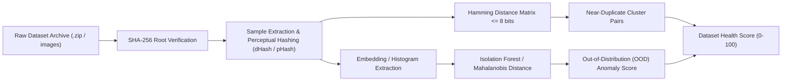

- **Perceptual Hash Distance**: Each image sample is evaluated using 64-bit perceptual hashing. Pairs possessing a Hamming distance $\le 8$ bits are categorized as near-duplicates (e.g., redundant frames, blurred variations, or automated copies).
- **OOD Detection**: Normalizes samples to 96-dimensional color/spatial distribution vectors. Isolation Forest scoring measures density divergence. Samples with score $> 0.80$ are marked anomalous/corrupted.

### Pillar II: Model Weight Authenticity & Tamper Detection (Weight: 30%)

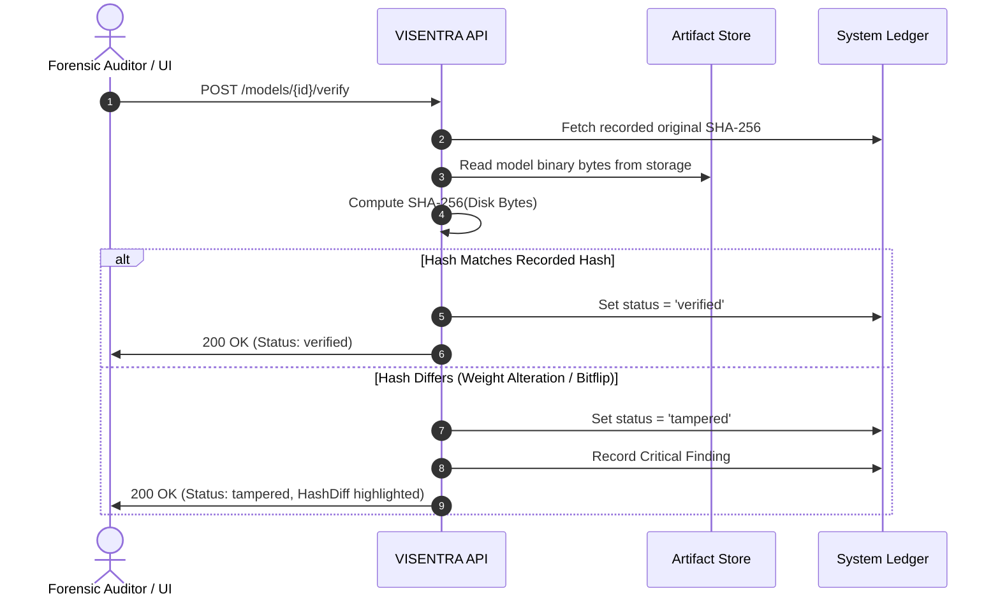

### Pillar III: Backdoor & Neural Trojan Interrogation (Weight: 25%)

The platform subjects the neural network to black-box perturbation attacks across a curated synthetic trigger library without requiring access to original training code:

| Trigger Type | Perturbation Technique | Target Class | Detection Threshold |
|---|---|---|---|
| `checkerboard` | High-contrast 4x4 checkerboard patch in bottom-right corner | Class 0 (Adversarial Target) | Anomaly Index $> 2.0$ |
| `blend` | 20% alpha blending of static watermark grid | Class 1 | Anomaly Index $> 2.5$ |
| `corner_patch` | Uniform white 6x6 pixel patch in top-left | Dynamic | Anomaly Index $> 2.0$ |

- **Anomaly Index Calculation**:
  $$\text{Anomaly Index} = \frac{\mathbb{E}[\text{Confidence}_{\text{perturbed}}]}{\mathbb{E}[\text{Confidence}_{\text{baseline}}]}$$
- A trigger that consistently drives the model output towards a specific target class with high confidence shift indicates a hidden Trojan shortcut.

### Pillar IV: Inference Binding & Cryptographic Proof (Weight: 25%)

To prevent execution-level spoofing or MITM tampering of model outputs, every inference execution generates a sealed cryptographic evidence record:

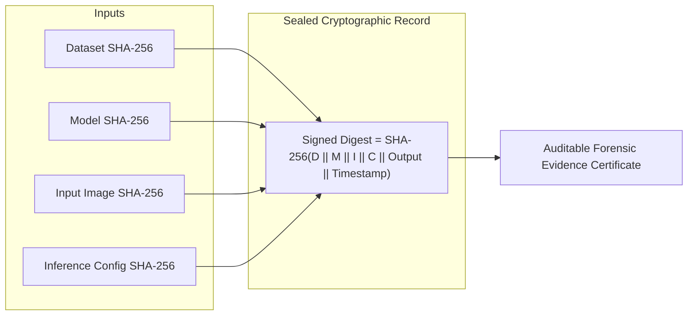

### Overall Score Formulation

$$S_{\text{overall}} = 0.20 \cdot S_{\text{dataset}} + 0.30 \cdot S_{\text{model}} + 0.25 \cdot S_{\text{backdoor}} + 0.25 \cdot S_{\text{inference}}$$

- **100 – 85**: Cryptographically verified, clean supply chain.
- **84 – 60**: Suspicious anomalies present (OOD samples, near-duplicates, or elevated trigger sensitivity).
- **< 60**: Critical breach (unauthorized weight alteration or confirmed neural Trojan).

---

## 4. Installation & Operational Setup

### Prerequisites

- **Python**: 3.10, 3.11, or 3.12 (64-bit)
- **Node.js**: 18.x or 20.x
- **Package Managers**: `pip` and `npm`
- **Git**: Installed and available in PATH

### Backend Service Deployment

1. Open a terminal in the project root:
   ```bash
   cd d:\EDU\Projects\Visentra
   ```
2. Create and activate a Python virtual environment:
   ```bash
   python -m venv .venv
   # Windows PowerShell:
   .\.venv\Scripts\Activate.ps1
   # Linux/macOS:
   source .venv/bin/activate
   ```
3. Install production dependencies:
   ```bash
   pip install -r backend/requirements.txt
   ```
4. Start the FastAPI uvicorn daemon:
   ```bash
   python -m uvicorn backend.main:app --host 127.0.0.1 --port 8000 --reload
   ```
5. Confirm backend availability:
   ```bash
   curl http://127.0.0.1:8000/health
   # Expected response: {"status":"ok","service":"visentra"}
   ```

### Frontend Instrument Deployment

1. In a separate terminal, navigate to `frontend`:
   ```bash
   cd frontend
   npm install
   ```
2. Launch the Vite development server:
   ```bash
   npm run dev -- --host 127.0.0.1
   ```
3. The forensic web interface will be accessible at:
   ```
   http://127.0.0.1:5173/
   ```

### Synthetic Demonstration Seeding

To immediately populate the platform with a full lineage graph including contributors, datasets with near-duplicates, ONNX models, and baseline backdoor evaluations:

```bash
python scripts/seed_demo.py
```

*This registers Contributor "Lab Alpha (SIH Demo)", uploads a 10-image synthetic dataset, loads an ONNX vision checkpoint, and runs initial integrity passes.*

---

## 5. Forensic Lab Instrument UI Walkthrough

The VISENTRA interface rejects typical dashboard clutter (gratuitous cards, saturated neon accents, generic pill buttons). Instead, it embodies a physical forensic workstation with a warm paper backdrop, precise vector glyphs, and high-density typography.

### Visual Language & Physical Lab Metaphor

```
+-----------------------------------------------------------------------------------------+
| Warm Paper Base: #F7F5F0   | Surface Raised: #FFFFFF     | Sunken Wells: #EDEAE2        |
| Deep Carbon Text: #171512  | Muted Labels: #8C8270       | Hairline Borders: 1px #D8D2C5|
| Zero Box Shadows           | Hard 2px/4px Radii          | IBM Plex Mono Values         |
+-----------------------------------------------------------------------------------------+
```

---

### Surface 1: Interactive Lineage Canvas & Top Toolbar

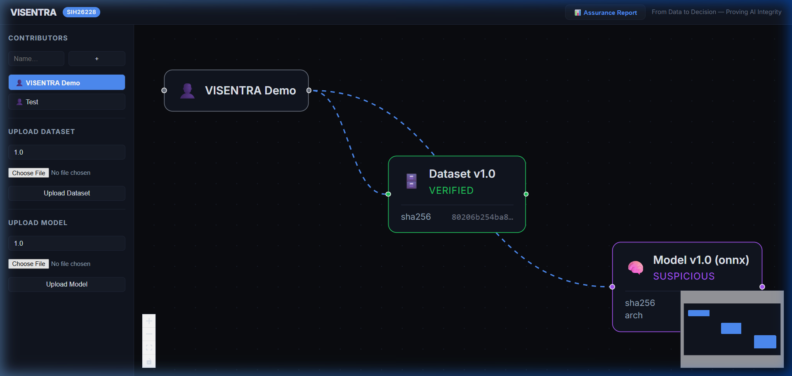

1. **Top Command Toolbar (38px height)**:
   - **Contributor Selector**: Dropdown to switch between independent supply chain chains.
   - **Status Filter Tabs**: Filter nodes on the fly (`All`, `Verified`, `Suspicious`, `Tampered`). Nodes outside the active filter are visually dimmed.
   - **Numeric Zoom**: Real-time canvas zoom percentage readout.
   - **Action Controls**:
     - `Tamper Demo`: Live-injects a byte payload into the active model checkpoint on disk to demonstrate real-time attack detection.
     - `Assurance Report`: Generates the exportable cryptographic certificate modal.
2. **React Flow Graph Canvas**:
   - Displays rectangular 190x68px artifact cards connected by smooth orthogonal lineage lines.
   - **Color-Coded Status Edge Stripe**:
     - *Verified*: Deep green left stripe (`#2E6B3E`).
     - *Suspicious*: Warm amber left stripe (`#8C6200`).
     - *Tampered*: Sharp red left stripe (`#B82A1E`).
   - Monospace 8-character cryptographic hash prefix with copy button.

---

### Surface 2: Live Supply-Chain Tamper Simulation & Event Drawer

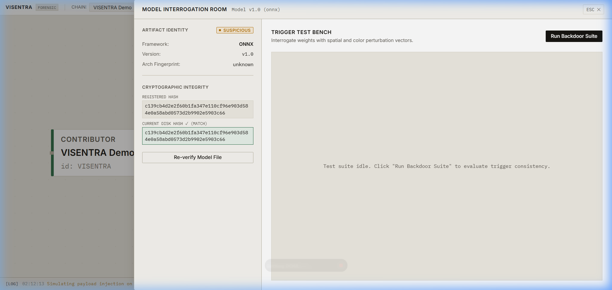

When you click the **`Tamper Demo`** button:
1. The backend corrupts the stored binary on disk with random bytes.
2. An automatic re-verification check fails.
3. The WebSocket server emits a `model_tampered` event.
4. **Visual Reaction**:
   - The edge connecting Dataset to Model transforms into an **animated, pulsing red dashed line**.
   - The Model card status tag flips immediately to `[TAMPERED]`.
   - The collapsible **Event Log Drawer** at the bottom reveals a live log entry:  
     `13:25:08 [model] TAMPER DETECTED: resnet50-classifier:v1.0 (Hash mismatch)`.

---

### Surface 3: Model Interrogation & Cryptographic Diff Room

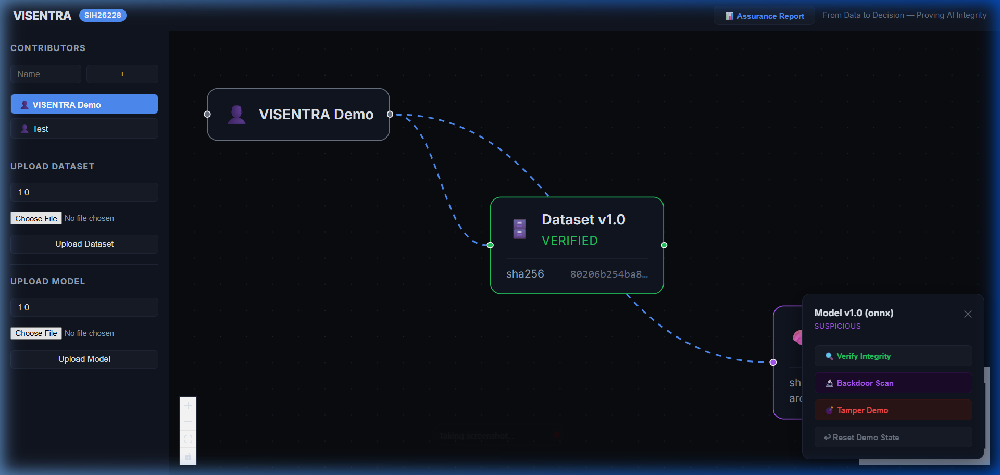

Clicking any **Model node** opens an 80% viewport slide-out panel from the right:
- **Left Column (Cryptographic Fingerprint & Diff)**:
  - Displays registered SHA-256 vs current disk SHA-256.
  - Character-by-character visual diff highlights altered hex digits in high-contrast red.
  - Architecture fingerprint breakdown (layer count, input tensors, parameter digest).
- **Right Column (Backdoor Trigger Test Bench)**:
  - Comprehensive trigger evaluation gallery (`checkerboard`, `blend`, `corner_patch`).
  - **Horizontal Instrument Dial**: Visualizes confidence shift before and after trigger application.
  - Individual **`Run Trigger Test`** buttons to execute real-time model perturbations.

---

### Surface 4: Dataset Inspector (Near-Duplicates & OOD)

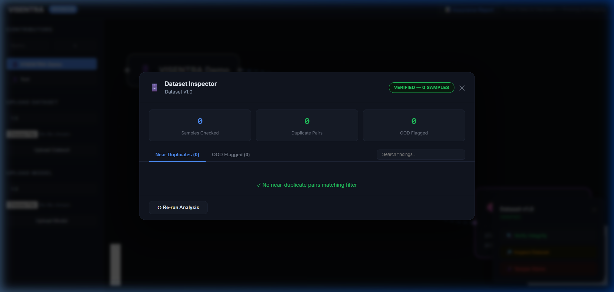

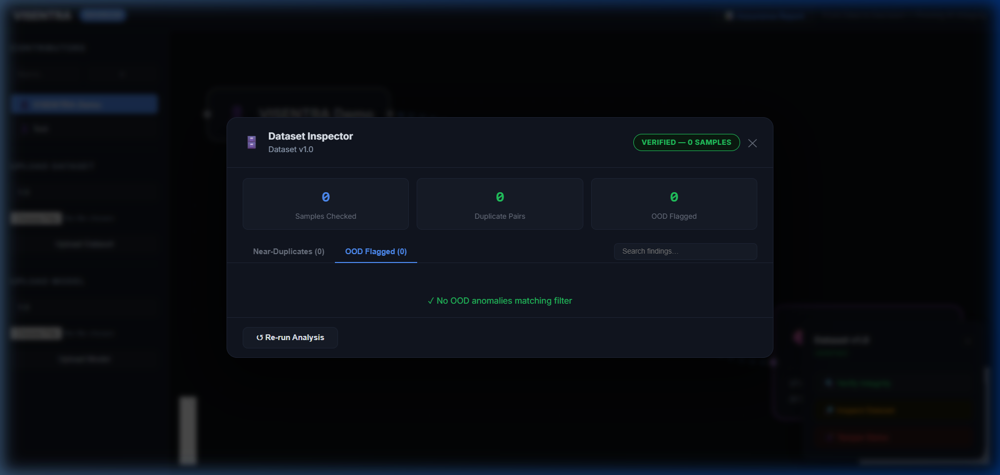

Clicking any **Dataset node** triggers the dataset assurance suite:
- **Header Strip**: Sample count, SHA-256 root digest, and aggregate status.
- **Inspector Tabs**:
  - `Near-Duplicates`: Displays matched pairs of samples whose perceptual hash distance is $\le 8$. Lists exact Hamming distance (e.g. `Hamming: 4`) and displays side-by-side comparative preview thumbnails.
  - `OOD Flagged`: Renders samples exhibiting feature anomalies calculated via Isolation Forest or Mahalanobis distance. Outlier scores are displayed on a clean monospace bar.
  - `All Samples`: Grid of all ingested images with instant zoom expansion.

---

### Surface 5: Inference Evidence Ledger & Re-verification

Clicking an **Inference node** presents the complete cryptographic execution certificate:
- **Dataset Hash Binding**: Verifies that the dataset used for training was unchanged.
- **Model Weight Binding**: Verifies the exact weight state at execution time.
- **Input Image Hash**: SHA-256 fingerprint of the user-submitted query image.
- **Signed Evidence Output**: Classification distribution, prediction confidence, and HMAC signature.
- **Re-verify Button**: Re-computes the entire cryptographic tuple on demand to guarantee historical integrity.

---

### Surface 6: Formal Cryptographic Assurance Certificate

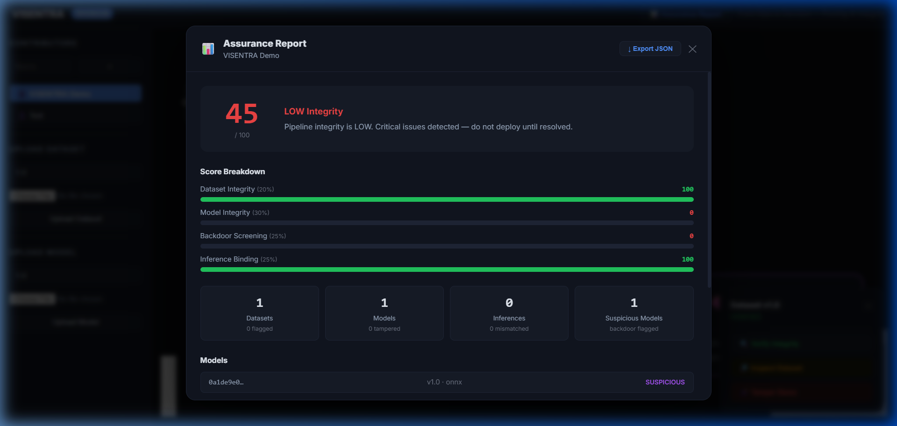

Clicking **`Assurance Report`** in the top toolbar opens the audit report document:
- **Header Stamp**: Unique Report UUID, Contributor Name, Target Architecture, Timestamp, and Overall Cryptographic Score (e.g., `82.0 / 100`).
- **Four-Pillar Score Breakdown**: Clear breakdown table showing weight, individual score, and status.
- **Detected Vulnerabilities & Findings**: Enumeration of any detected tampering events or backdoor triggers.
- **Stated Limitations**: Explicit legal and technical boundaries (e.g., black-box heuristic limits, resolution coverage).
- **Actions**:
  - `Print / Export PDF`: Opens browser print dialog styled for physical paper output.
  - `Close`: Returns smoothly to the lineage graph.

---

## 6. Interactive User Workflows & Flowcharts

### Workflow A: Supply-Chain Ingestion & Baseline Verification

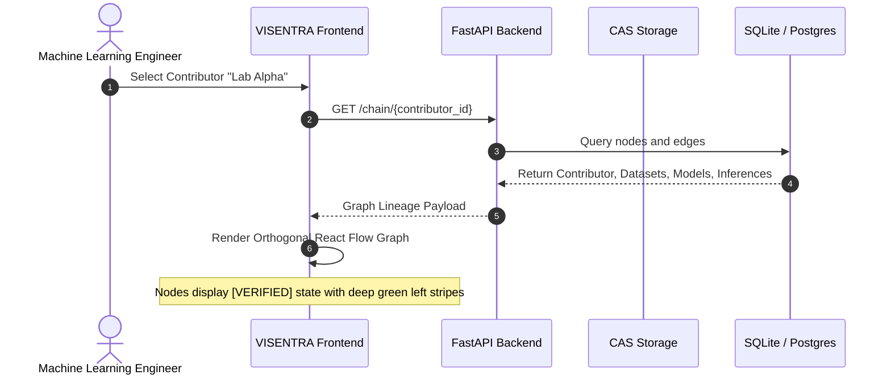

### Workflow B: Detecting Weight Corruption & Visualizing Breach Trajectories

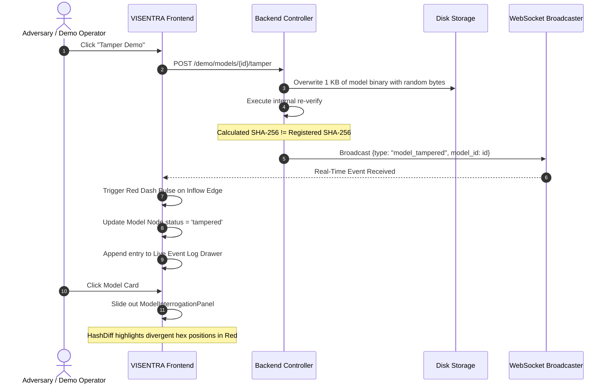

### Workflow C: Trigger-Consistency Model Interrogation

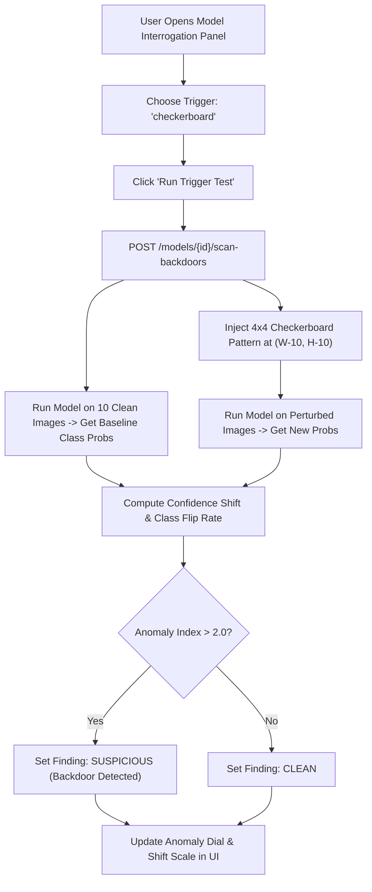

### Workflow D: Dataset Sanitization & Anomaly Screening

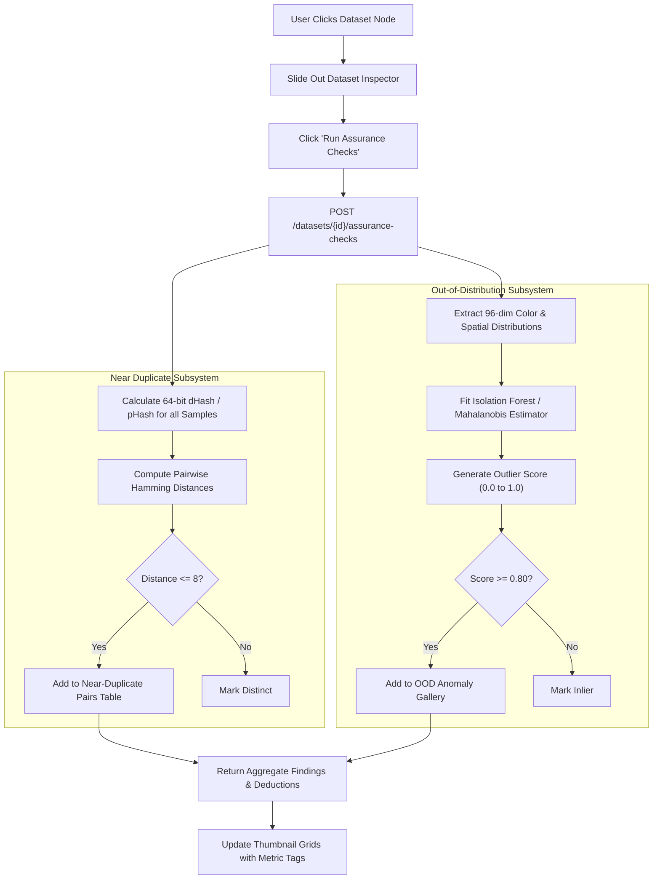

### Workflow E: Generating and Exporting Audit Certificates

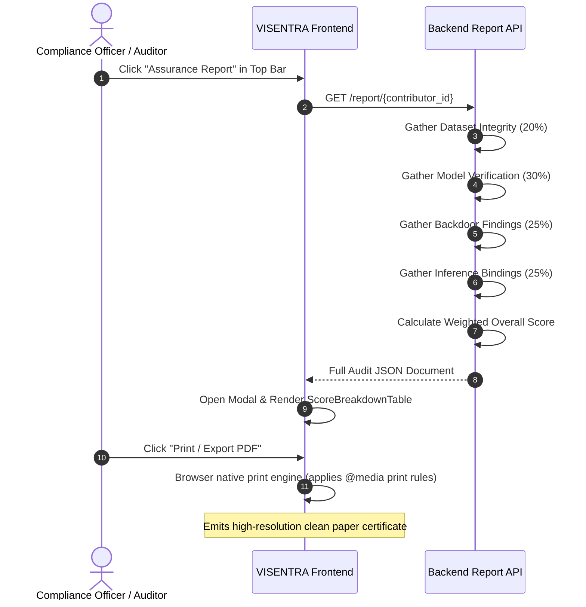

---

## 7. API Specification & Real-Time Event Protocol

### Core REST Endpoints

| Method | Endpoint | Description | Request Payload | Response Schema |
|---|---|---|---|---|
| `GET` | `/health` | Service liveness & readiness check | None | `{"status": "ok", "service": "visentra"}` |
| `GET` | `/contributors` | List all registered organizations/contributors | None | `[{"id": "uuid", "name": "str", "created_at": "iso"}]` |
| `POST` | `/contributors` | Create a new contributor | `{"name": "Lab Beta"}` | `{"id": "uuid", "name": "str"}` |
| `GET` | `/chain/{contributor_id}` | Retrieve full lineage graph (nodes & edges) | None | `{"contributor": {...}, "datasets": [...], "models": [...]}` |
| `POST` | `/datasets` | Upload and content-address a new dataset archive | Multipart form (`file`, `contributor_id`, `version`) | `{"id": "uuid", "sha256": "hex", "status": "pending"}` |
| `POST` | `/datasets/{id}/verify` | Recalculate root SHA-256 from disk | None | `{"id": "uuid", "status": "verified"}` |
| `POST` | `/datasets/{id}/assurance-checks` | Execute near-duplicate and OOD scoring | None | `{"near_duplicates": [...], "ood_samples": [...]}` |
| `POST` | `/models` | Ingest ONNX or PyTorch model file | Multipart form (`file`, `contributor_id`, `version`) | `{"id": "uuid", "sha256": "hex", "status": "pending"}` |
| `POST` | `/models/{id}/verify` | Recalculate model SHA-256 from disk storage | None | `{"id": "uuid", "status": "verified"}` |
| `POST` | `/models/{id}/scan-backdoors` | Execute trigger perturbation test suite | `{"triggers": ["checkerboard", "blend"]}` | `{"findings": [...], "status": "clean"}` |
| `POST` | `/inference` | Run inference and seal cryptographic evidence | Multipart form (`image`, `model_id`, `config`) | `{"id": "uuid", "output": {...}, "signature": "hex"}` |
| `GET` | `/inference/{id}` | Retrieve sealed inference evidence ledger | None | Evidence Record JSON |
| `POST` | `/inference/{id}/reverify` | Re-verify cryptographic binding tuple | None | `{"status": "ok", "valid": true}` |
| `GET` | `/report/{contributor_id}` | Generate formal cryptographic audit score | None | Assurance Report Object |
| `POST` | `/demo/models/{id}/tamper` | Corrupt model on disk (demo mode) | None | `{"status": "tampered", "bytes_modified": 1024}` |
| `POST` | `/demo/models/{id}/restore` | Restore original clean model (demo mode) | None | `{"status": "restored"}` |

### WebSocket Event Protocol

Connect to `ws://127.0.0.1:8000/ws/status`. The hub emits real-time events upon state changes:

```json
{
  "type": "model_tampered",
  "model_id": "9b1deb4d-3b7d-4bad-9bdd-2b0d7b3dcb6d",
  "status": "tampered",
  "timestamp": "2026-09-28T02:15:30Z",
  "detail": "SHA-256 digest divergence detected during live verification."
}
```

```json
{
  "type": "backdoor_scan_completed",
  "model_id": "9b1deb4d-3b7d-4bad-9bdd-2b0d7b3dcb6d",
  "status": "suspicious",
  "finding_count": 1
}
```

---

## 8. Troubleshooting & Operational FAQ

### Q1: The Lineage Graph displays "No contributor selected" or an empty canvas.
- **Resolution**: Open the dropdown in the top-left toolbar and pick `Lab Alpha (SIH Demo)`. If the dropdown is empty, run the demo seed script:
  ```bash
  python scripts/seed_demo.py
  ```

### Q2: When I click "Tamper Demo", the edge turns red, but how do I reset it to green?
- **Resolution**: You can restore the original clean checkpoint via the REST API or by calling restore:
  ```bash
  curl -X POST http://127.0.0.1:8000/demo/models/<MODEL_UUID>/restore
  ```
  Or re-run the seed script to reset the database and content store cleanly.

### Q3: Why do thumbnails in the Dataset Inspector load instantly without lag?
- VISENTRA incorporates dynamic thumbnail compression and cache headers. Large source images are downsampled to lightweight preview tiles upon ingestion, ensuring zero frame drops even with thousands of samples.

### Q4: Are my uploaded models sent to third-party cloud services?
- **Zero External Egress**: VISENTRA executes entirely on local infrastructure or private VPCs. Model weights, dataset samples, and inference records never leave the content-addressed perimeter.
